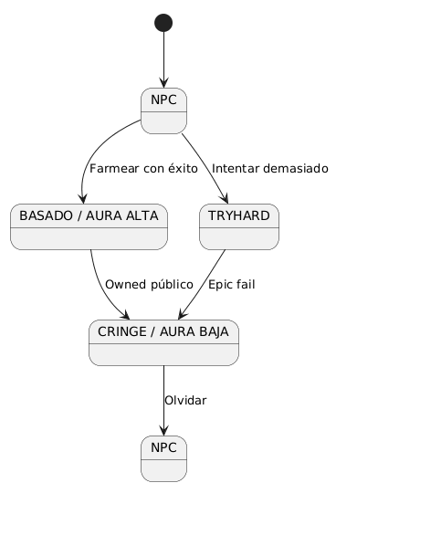
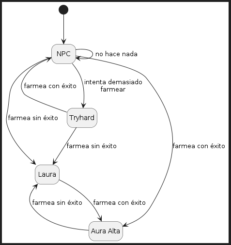
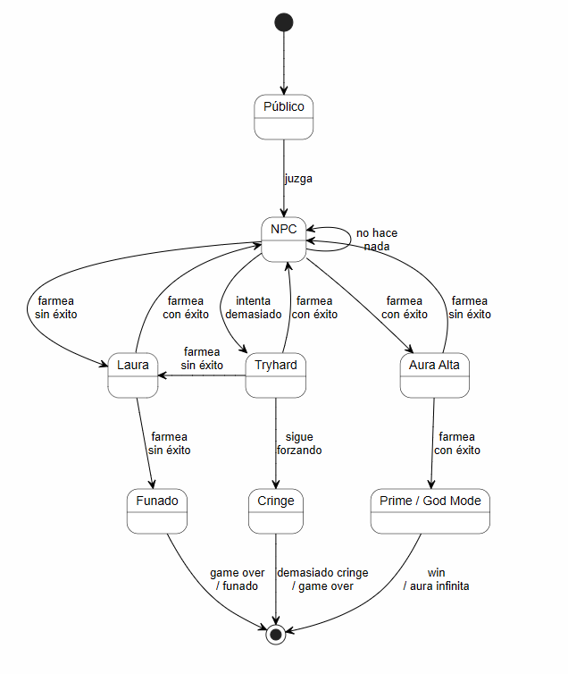

# Glosario Brevisimo
## Farmear Aura
Aura: Medida intangible de presencia o estatus social de una Persona.

Farmear: Ejecutar una serie de acciones (con o sin intención) con el resultado de conseguir aura.

Persona: Entidad con capacidad social que adopta el rol de Agente (quien ejecuta el comportamiento) o Espectador (quien valida y procesa la percepción).

Laura (Aura Negativa / Pérdida): Resta de Aura causada por un fallo social, torpeza, sobreesfuerzo o falta de compostura

## Diagrama de Estados 

## Diagrama de Estados V2

## Diagrama de Estados V3

## Cosas a mejorar? 

- [x] incorporar el concepto de "Laura" 
- [ ] hacerlo mas entendible para el cliente
- [x] incorporar el estado del Circulo/jueces/valoradores
- [x] un estado final
- [x] Prime o God Mode
- [x] Funado
- [x] Demasiado tryhard --> Cringe
- [ ] iterar
